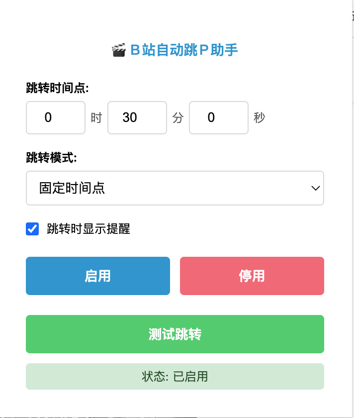

# B站自动跳P助手

自动检测B站多P视频并跳转到下一集的Chrome扩展。

## 功能

- 自动识别多P视频和合集
- 自定义跳转时间（时分秒）
- 两种跳转模式：固定时间点 / 视频结束前
- 跳转提醒通知
- 手动测试跳转

## 📱 插件界面

  
  
<em>插件设置界面，支持自定义跳转时间和模式</em>

### 界面说明

- **跳转时间点**：设置小时、分钟、秒数
- **跳转模式**：
  - 固定时间点：在指定时间跳转
  - 视频结束前：在视频结束前N秒跳转
- **跳转提醒**：开启后会显示跳转通知
- **启用/停用**：一键开关自动跳转功能
- **测试跳转**：手动测试跳转功能
- **状态显示**：实时显示插件运行状态

## 下载安装

### 方式一：直接下载

1. [📦 下载最新版本](https://github.com/wyh0626/bilibili-auto-next/releases/tag/v1.0.0)
2. 下载 `bilibili-auto-next-v1.0.0.zip` 压缩包
3. 解压到文件夹
4. Chrome浏览器打开 `chrome://extensions/`
5. 开启「开发者模式」
6. 点击「加载已解压的扩展程序」选择解压的文件夹

### 方式二：从源码构建

1. `git clone https://github.com/wyh0626/bilibili-auto-next.git`
2. 在Chrome中加载解压的扩展程序

## 使用

1. 安装后点击扩展图标打开设置
2. 设置跳转时间和模式
3. 开启自动跳转功能
4. 在B站观看多P视频时会自动跳转

## 许可证

MIT License
